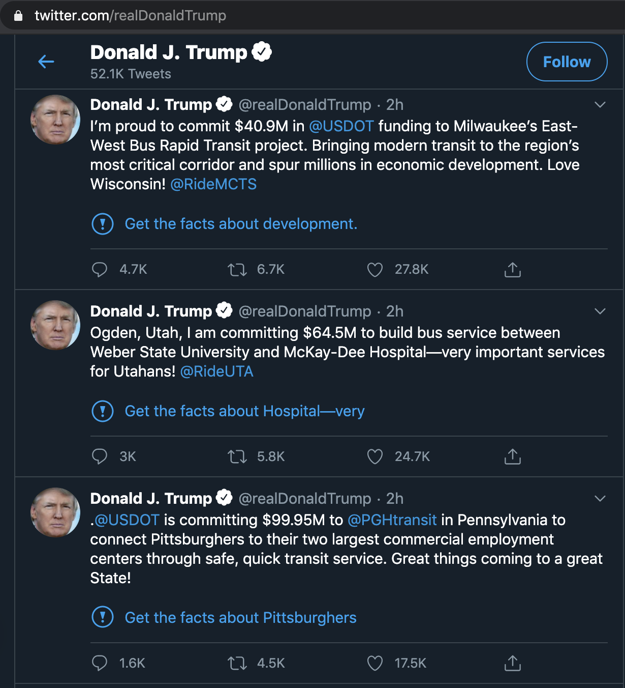
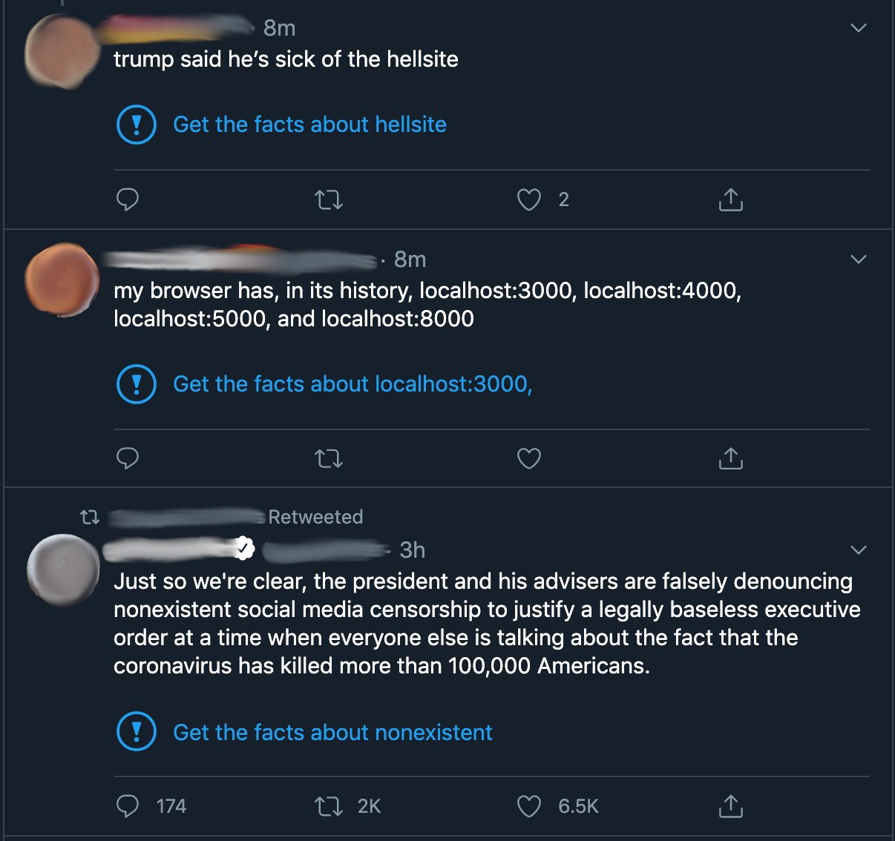

# Chrome extension that adds "Get the facts about XYZ" to every tweet

MVP stage—"fact checks" disappear after a few seconds and don't generate for tweets that load as you keep scrolling.

To install this Chrome extension:

1. Enable Developer Mode by going to chrome://extensions and flipping the switch in the top right hand corner

2. Download/clone this repo

3. Click **Load unpacked** and select this folder

